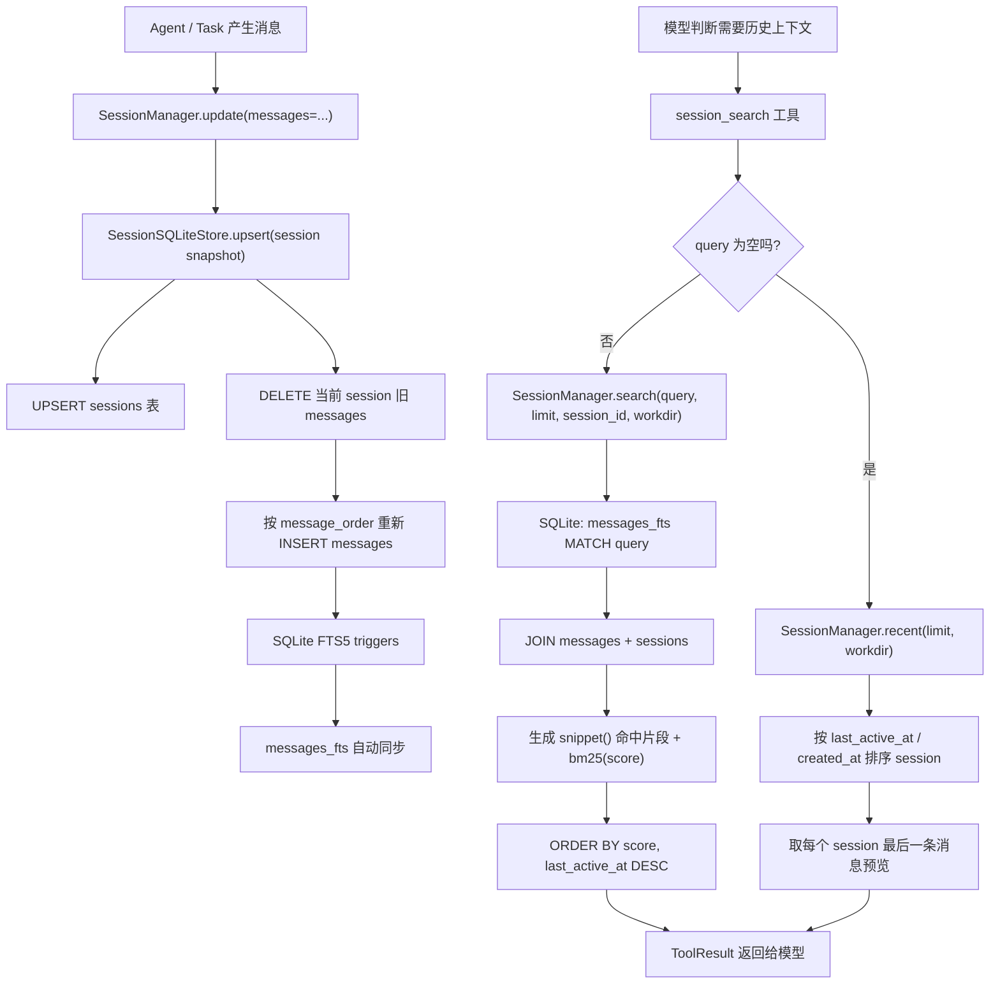

```mermaid
flowchart TD
    A["Agent / Task 产生消息"] --> B["SessionManager.update(messages=...)"]
    B --> C["SessionSQLiteStore.upsert(session snapshot)"]

    C --> D["UPSERT sessions 表"]
    C --> E["DELETE 当前 session 旧 messages"]
    E --> F["按 message_order 重新 INSERT messages"]
    F --> G["SQLite FTS5 triggers"]
    G --> H["messages_fts 自动同步"]

    I["模型判断需要历史上下文"] --> J["session_search 工具"]
    J --> K{"query 为空吗?"}

    K -- "否" --> L["SessionManager.search(query, limit, session_id, workdir)"]
    L --> M["SQLite: messages_fts MATCH query"]
    M --> N["JOIN messages + sessions"]
    N --> O["生成 snippet() 命中片段 + bm25(score)"]
    O --> P["ORDER BY score, last_active_at DESC"]
    P --> Q["ToolResult 返回给模型"]

    K -- "是" --> R["SessionManager.recent(limit, workdir)"]
    R --> S["按 last_active_at / created_at 排序 session"]
    S --> T["取每个 session 最后一条消息预览"]
    T --> Q

```